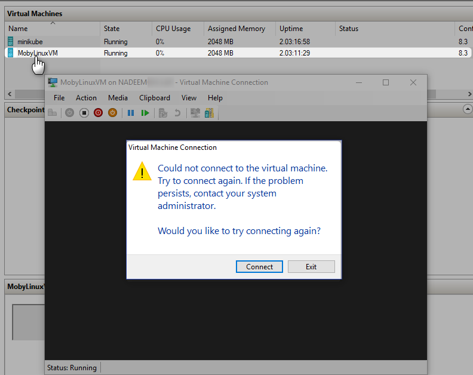

[Home](README.md)

# Connect to Docker VM (MobiLinuxVM) on Windows

On Windows 10 with HyperV enabled, you cann't connect to MobiLinuxVM (Docker VM on Windows 10)



Docker Version Used

```Powershell
D:\>docker --version
Docker version 18.09.2, build 6247962

D:\>
```

It is not possible to SSH into Docker VM, however there is a backdoor.

* Create a container with full root access
* Access the filesystem from the container

## Get a privileged container with access to Docker daemon

```Powershell
docker run --privileged -it -v /var/run/docker.sock:/var/run/docker.sock docker sh
```

## run a container with full root access to MobyLinuxVM and no seccomp profile (so you can mount stuff)

```Powershell
docker run --net=host --ipc=host --uts=host --pid=host -it --security-opt=seccomp=unconfined --privileged --rm -v /:/host alpine /bin/sh
```

## Switch to host File System

```Powershell
chroot /host
```

Here is command execution with output

```Powershell
D:\practices\docker\maven-docker>docker run --privileged -it -v /var/run/docker.sock:/var/run/docker.sock docker sh
Unable to find image 'docker:latest' locally
latest: Pulling from library/docker
8e402f1a9c57: Already exists
ce7779d8bfe3: Pull complete
de1a1e452942: Pull complete
83465382163b: Pull complete
d998591732df: Pull complete
968b299526c5: Pull complete
Digest: sha256:0559f101de7c5f118f7b4dd6cc6051c68feabe2f2c0ea5b4b45fc9d22b4c2fe2
Status: Downloaded newer image for docker:latest

/ # docker run --net=host --ipc=host --uts=host --pid=host -it --security-opt=seccomp=unconfined --privileged --rm -v /:/host alpine /bin/sh

/ # chroot /host

/ # cd /var/lib/docker
/var/lib/docker # ls
builder  buildkit  containerd  containers  image  network  overlay2  plugins  runtimes  swarm  tmp  trust  volumes

/var/lib/docker # docker --version
Docker version 18.09.2, build 6247962
/var/lib/docker #
```


# References
* [Article](https://forums.docker.com/t/how-can-i-ssh-into-the-betas-mobylinuxvm/10991/7)