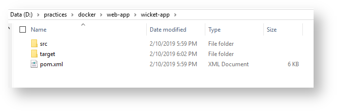
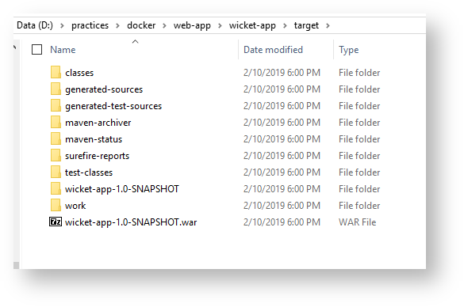
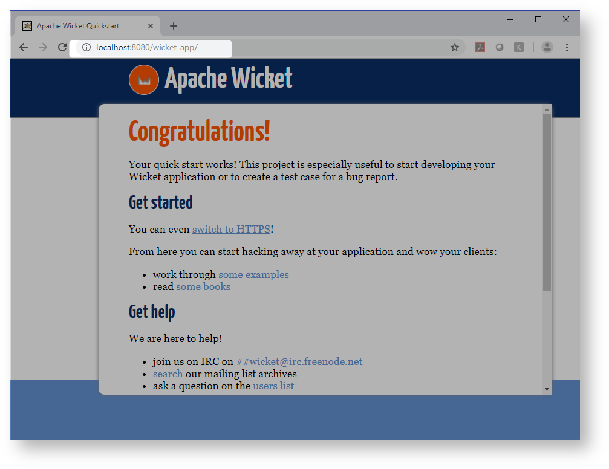

[Home](README.md)

# Containerize Tomcat Application


## Build And Package

Lets create simple Apache [Wicket application](https://wicket.apache.org/start/quickstart.html) (It could be any web-app), for that will use wicket maven archetype

-------------------------------

```Powershell
mvn archetype:generate -DarchetypeGroupId=org.apache.wicket -DarchetypeArtifactId=wicket-archetype-quickstart -DarchetypeVersion=8.3.0 -DgroupId=com.mycompany -DartifactId=wicket-app -DarchetypeRepository=https://repository.apache.org/ -DinteractiveMode=false

```

-------------------------------
Here is the directory structure created


### Lets build

```Powershell
D:\practices\docker\web-app>mvn package
```

Files are maven build



## Containerize And Deploy
### Lets write Dockerfile

```Powershell
FROM tomcat:8.5
ADD wicket-app/target/wicket-app-1.0-SNAPSHOT.war /usr/local/tomcat/webapps/
RUN mv /usr/local/tomcat/webapps/wicket-app-1.0-SNAPSHOT.war /usr/local/tomcat/webapps/wicket-app.war
EXPOSE 8080
CMD chmod +x /usr/local/tomcat/bin/catalina.sh
CMD ["catalina.sh", "run"]
```

### Build id


```Powershell
PS D:\practices\docker\web-app> docker build -t wicket-app .
Sending build context to Docker daemon  7.639MB
Step 1/6 : FROM tomcat:8.5
 ---> 168588387c68
Step 2/6 : ADD wicket-app/target/wicket-app-1.0-SNAPSHOT.war /usr/local/tomcat/webapps/
 ---> Using cache
 ---> fd0ca260cb17
Step 3/6 : RUN mv /usr/local/tomcat/webapps/wicket-app-1.0-SNAPSHOT.war /usr/local/tomcat/webapps/wicket-app.war
 ---> Running in 6c128ceaa518
Removing intermediate container 6c128ceaa518
 ---> 688b97987e0c
Step 4/6 : EXPOSE 8080
 ---> Running in 3a6eb3886733
Removing intermediate container 3a6eb3886733
 ---> 485a0e30d6a9
Step 5/6 : CMD chmod +x /usr/local/tomcat/bin/catalina.sh
 ---> Running in 81c69e0b4096
Removing intermediate container 81c69e0b4096
 ---> a909f495ade7
Step 6/6 : CMD ["catalina.sh", "run"]
 ---> Running in 909de3fbadd5
Removing intermediate container 909de3fbadd5
 ---> bab320855599
Successfully built bab320855599
Successfully tagged wicket-app:latest
SECURITY WARNING: You are building a Docker image from Windows against a non-Windows Docker host. All files and directories added to build context will have '-rwxr-xr-x' permissions. It is recommended to double check and reset permissions for sensitive files and directories.

```


### Run it

```Powershell
PS D:\practices\docker\web-app> docker run -p 8080:8080 -it wicket-app
```

**Output**

```Powershell
Using CATALINA_BASE:   /usr/local/tomcat
Using CATALINA_HOME:   /usr/local/tomcat
Using CATALINA_TMPDIR: /usr/local/tomcat/temp
Using JRE_HOME:        /docker-java-home/jre
Using CLASSPATH:       /usr/local/tomcat/bin/bootstrap.jar:/usr/local/tomcat/bin/tomcat-juli.jar
10-Feb-2019 13:05:18.389 INFO [main] org.apache.catalina.startup.VersionLoggerListener.log Server version:        Apache Tomcat/8.5.38
10-Feb-2019 13:05:18.392 INFO [main] org.apache.catalina.startup.VersionLoggerListener.log Server built:          Feb 5 2019 11:42:42 UTC
10-Feb-2019 13:05:18.392 INFO [main] org.apache.catalina.startup.VersionLoggerListener.log Server number:         8.5.38.0
10-Feb-2019 13:05:18.392 INFO [main] org.apache.catalina.startup.VersionLoggerListener.log OS Name:               Linux
10-Feb-2019 13:05:18.392 INFO [main] org.apache.catalina.startup.VersionLoggerListener.log OS Version:            4.9.125-linuxkit
10-Feb-2019 13:05:18.393 INFO [main] org.apache.catalina.startup.VersionLoggerListener.log Architecture:          amd64
10-Feb-2019 13:05:18.393 INFO [main] org.apache.catalina.startup.VersionLoggerListener.log Java Home:             /usr/lib/jvm/java-8-openjdk-amd64/jre
10-Feb-2019 13:05:18.393 INFO [main] org.apache.catalina.startup.VersionLoggerListener.log JVM Version:           1.8.0_181-8u181-b13-2~deb9u1-b13
10-Feb-2019 13:05:18.393 INFO [main] org.apache.catalina.startup.VersionLoggerListener.log JVM Vendor:            Oracle Corporation
10-Feb-2019 13:05:18.396 INFO [main] org.apache.catalina.startup.VersionLoggerListener.log CATALINA_BASE:         /usr/local/tomcat
10-Feb-2019 13:05:18.397 INFO [main] org.apache.catalina.startup.VersionLoggerListener.log CATALINA_HOME:         /usr/local/tomcat
10-Feb-2019 13:05:18.403 INFO [main] org.apache.catalina.startup.VersionLoggerListener.log Command line argument: -Djava.util.logging.config.file=/usr/local/tomcat/conf/logging.properties
10-Feb-2019 13:05:18.404 INFO [main] org.apache.catalina.startup.VersionLoggerListener.log Command line argument: -Djava.util.logging.manager=org.apache.juli.ClassLoaderLogManager
10-Feb-2019 13:05:18.405 INFO [main] org.apache.catalina.startup.VersionLoggerListener.log Command line argument: -Djdk.tls.ephemeralDHKeySize=2048
10-Feb-2019 13:05:18.405 INFO [main] org.apache.catalina.startup.VersionLoggerListener.log Command line argument: -Djava.protocol.handler.pkgs=org.apache.catalina.webresources
10-Feb-2019 13:05:18.406 INFO [main] org.apache.catalina.startup.VersionLoggerListener.log Command line argument: -Dorg.apache.catalina.security.SecurityListener.UMASK=0027
10-Feb-2019 13:05:18.406 INFO [main] org.apache.catalina.startup.VersionLoggerListener.log Command line argument: -Dignore.endorsed.dirs=
10-Feb-2019 13:05:18.407 INFO [main] org.apache.catalina.startup.VersionLoggerListener.log Command line argument: -Dcatalina.base=/usr/local/tomcat
10-Feb-2019 13:05:18.407 INFO [main] org.apache.catalina.startup.VersionLoggerListener.log Command line argument: -Dcatalina.home=/usr/local/tomcat
10-Feb-2019 13:05:18.408 INFO [main] org.apache.catalina.startup.VersionLoggerListener.log Command line argument: -Djava.io.tmpdir=/usr/local/tomcat/temp
10-Feb-2019 13:05:18.408 INFO [main] org.apache.catalina.core.AprLifecycleListener.lifecycleEvent Loaded APR based Apache Tomcat Native library [1.2.21] using APR version [1.5.2].
10-Feb-2019 13:05:18.409 INFO [main] org.apache.catalina.core.AprLifecycleListener.lifecycleEvent APR capabilities: IPv6 [true], sendfile [true], accept filters [false], random [true].
10-Feb-2019 13:05:18.409 INFO [main] org.apache.catalina.core.AprLifecycleListener.lifecycleEvent APR/OpenSSL configuration: useAprConnector [false], useOpenSSL [true]
10-Feb-2019 13:05:18.421 INFO [main] org.apache.catalina.core.AprLifecycleListener.initializeSSL OpenSSL successfully initialized [OpenSSL 1.1.0j  20 Nov 2018]
10-Feb-2019 13:05:18.545 INFO [main] org.apache.coyote.AbstractProtocol.init Initializing ProtocolHandler ["http-nio-8080"]
10-Feb-2019 13:05:18.561 INFO [main] org.apache.tomcat.util.net.NioSelectorPool.getSharedSelector Using a shared selector for servlet write/read
10-Feb-2019 13:05:18.577 INFO [main] org.apache.coyote.AbstractProtocol.init Initializing ProtocolHandler ["ajp-nio-8009"]
10-Feb-2019 13:05:18.579 INFO [main] org.apache.tomcat.util.net.NioSelectorPool.getSharedSelector Using a shared selector for servlet write/read
10-Feb-2019 13:05:18.580 INFO [main] org.apache.catalina.startup.Catalina.load Initialization processed in 703 ms
10-Feb-2019 13:05:18.624 INFO [main] org.apache.catalina.core.StandardService.startInternal Starting service [Catalina]
10-Feb-2019 13:05:18.625 INFO [main] org.apache.catalina.core.StandardEngine.startInternal Starting Servlet Engine: Apache Tomcat/8.5.38
10-Feb-2019 13:05:18.672 INFO [localhost-startStop-1] org.apache.catalina.startup.HostConfig.deployWAR Deploying web application archive [/usr/local/tomcat/webapps/wicket-app.war]
10-Feb-2019 13:05:19.574 INFO [localhost-startStop-1] org.apache.jasper.servlet.TldScanner.scanJars At least one JAR was scanned for TLDs yet contained no TLDs. Enable debug logging for this logger for a complete list of JARs that were scanned but no TLDs were found in them. Skipping unneeded JARs during scanning can improve startup time and JSP compilation time.
[localhost-startStop-1] INFO org.apache.wicket.util.file.WebXmlFile - web.xml: url mapping found for filter with name wicket.wicket-app: [/*]
[localhost-startStop-1] INFO org.apache.wicket.Application - [wicket.wicket-app] init: Wicket core library initializer
[localhost-startStop-1] INFO org.apache.wicket.protocol.http.WebApplication - [wicket.wicket-app] Started Wicket version 8.3.0 in DEVELOPMENT mode
********************************************************************
*** WARNING: Wicket is running in DEVELOPMENT mode.              ***
***                               ^^^^^^^^^^^                    ***
*** Do NOT deploy to your live server(s) without changing this.  ***
*** See Application#getConfigurationType() for more information. ***
********************************************************************
10-Feb-2019 13:05:20.032 INFO [localhost-startStop-1] org.apache.catalina.startup.HostConfig.deployWAR Deployment of web application archive [/usr/local/tomcat/webapps/wicket-app.war] has finished in [1,359] ms
10-Feb-2019 13:05:20.033 INFO [localhost-startStop-1] org.apache.catalina.startup.HostConfig.deployDirectory Deploying web application directory [/usr/local/tomcat/webapps/ROOT]
10-Feb-2019 13:05:20.063 INFO [localhost-startStop-1] org.apache.catalina.startup.HostConfig.deployDirectory Deployment of web application directory [/usr/local/tomcat/webapps/ROOT] has finished in [30] ms
10-Feb-2019 13:05:20.063 INFO [localhost-startStop-1] org.apache.catalina.startup.HostConfig.deployDirectory Deploying web application directory [/usr/local/tomcat/webapps/examples]
10-Feb-2019 13:05:20.432 INFO [localhost-startStop-1] org.apache.catalina.startup.HostConfig.deployDirectory Deployment of web application directory [/usr/local/tomcat/webapps/examples] has finished in [369] ms
10-Feb-2019 13:05:20.435 INFO [localhost-startStop-1] org.apache.catalina.startup.HostConfig.deployDirectory Deploying web application directory [/usr/local/tomcat/webapps/host-manager]
10-Feb-2019 13:05:20.467 INFO [localhost-startStop-1] org.apache.catalina.startup.HostConfig.deployDirectory Deployment of web application directory [/usr/local/tomcat/webapps/host-manager] has finished in [33] ms
10-Feb-2019 13:05:20.469 INFO [localhost-startStop-1] org.apache.catalina.startup.HostConfig.deployDirectory Deploying web application directory [/usr/local/tomcat/webapps/manager]
10-Feb-2019 13:05:20.503 INFO [localhost-startStop-1] org.apache.catalina.startup.HostConfig.deployDirectory Deployment of web application directory [/usr/local/tomcat/webapps/manager] has finished in [35] ms
10-Feb-2019 13:05:20.506 INFO [localhost-startStop-1] org.apache.catalina.startup.HostConfig.deployDirectory Deploying web application directory [/usr/local/tomcat/webapps/docs]
10-Feb-2019 13:05:20.532 INFO [localhost-startStop-1] org.apache.catalina.startup.HostConfig.deployDirectory Deployment of web application directory [/usr/local/tomcat/webapps/docs] has finished in [26] ms
10-Feb-2019 13:05:20.539 INFO [main] org.apache.coyote.AbstractProtocol.start Starting ProtocolHandler ["http-nio-8080"]
10-Feb-2019 13:05:20.557 INFO [main] org.apache.coyote.AbstractProtocol.start Starting ProtocolHandler ["ajp-nio-8009"]
10-Feb-2019 13:05:20.566 INFO [main] org.apache.catalina.startup.Catalina.start Server startup in 1985 ms
```


### App up and running



### Mean while on a different shell

```Powershell
D:\practices\docker\web-app\wicket-app>docker ps
CONTAINER ID        IMAGE               COMMAND             CREATED             STATUS              PORTS                    NAMES
579f7a43d715        wicket-app          "catalina.sh run"   11 minutes ago      Up 11 minutes       0.0.0.0:8080->8080/tcp   determined_benz
```
you can inspect running container.

```Powershell
D:\practices\docker\web-app\wicket-app>docker exec -it 579f7a43d715 bash
root@579f7a43d715:/usr/local/tomcat# ls
BUILDING.txt  CONTRIBUTING.md  LICENSE  NOTICE  README.md  RELEASE-NOTES  RUNNING.txt  bin  conf  include  lib  logs  native-jni-lib  temp  webapps  work
root@579f7a43d715:/usr/local/tomcat# cd webapps/
root@579f7a43d715:/usr/local/tomcat/webapps# ls
ROOT  docs  examples  host-manager  manager  wicket-app  wicket-app.war
root@579f7a43d715:/usr/local/tomcat/webapps#
```

