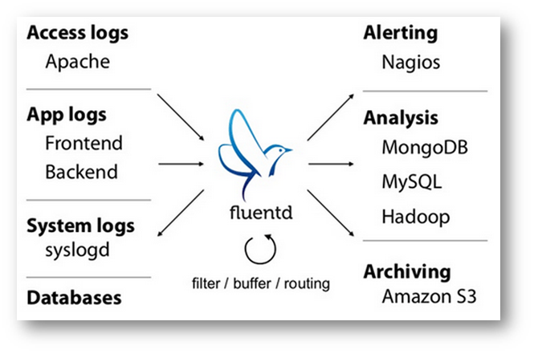
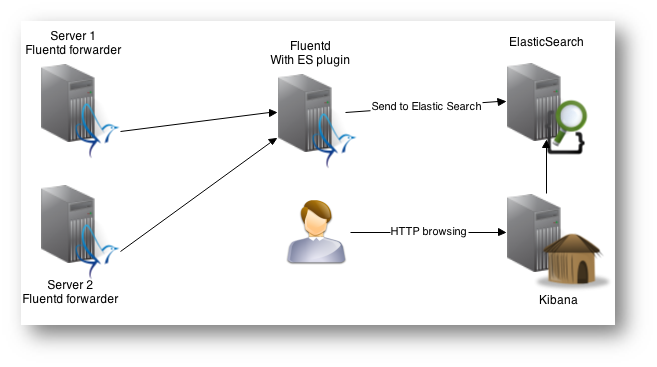
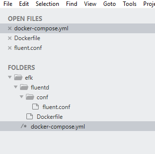
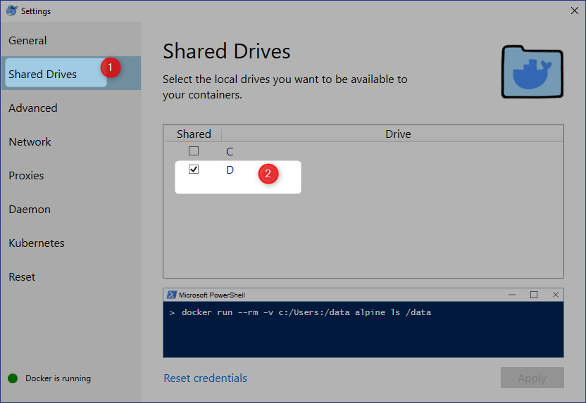
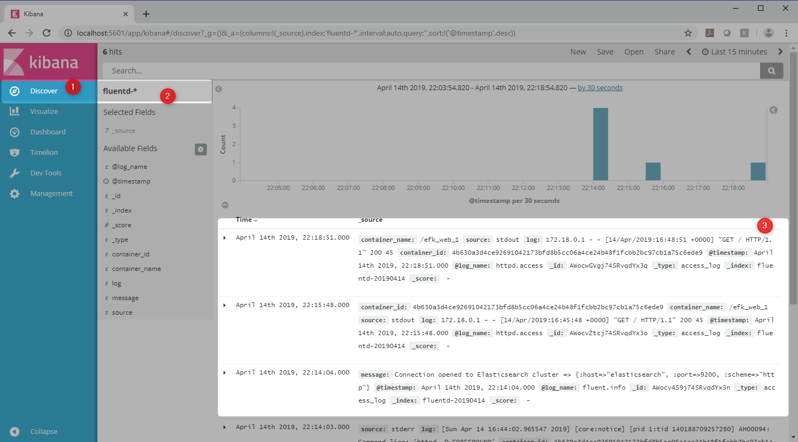

[Home](README.md)

# Docker Logging via EFK (Elasticsearch + Fluentd + Kibana) 







Lets create `docker-compose.yml`

```yml
version: '2'
services:
  web:
    image: httpd
    ports:
      - "80:80"
    links:
      - fluentd
    logging:
      driver: "fluentd"
      options:
        fluentd-address: localhost:24224
        tag: httpd.access

  fluentd:
    build: ./fluentd
    volumes:
      - ./fluentd/conf:/fluentd/etc
    links:
      - "elasticsearch"
    ports:
      - "24224:24224"
      - "24224:24224/udp"

  elasticsearch:
    image: elasticsearch:5.3.0
    expose:
      - 9200
    ports:
      - "9200:9200"

  kibana:
    image: kibana:5.3.0
    links:
      - "elasticsearch"
    ports:
      - "5601:5601"
```

Here is the project structure




Here is the dockerfile for fluentD

```
# fluentd/Dockerfile
FROM fluent/fluentd:v0.12-debian
RUN ["gem", "install", "fluent-plugin-elasticsearch", "--no-rdoc", "--no-ri", "--version", "1.9.7"]
```

fluentD config

```Powershell
# fluentd/conf/fluent.conf
<source>
  @type forward
  port 24224
  bind 0.0.0.0
</source>
<match *.**>
  @type copy
  <store>
    @type elasticsearch
    host elasticsearch
    port 9200
    logstash_format true
    logstash_prefix fluentd
    logstash_dateformat %Y%m%d
    include_tag_key true
    type_name access_log
    tag_key @log_name
    flush_interval 1s
  </store>
  <store>
    @type stdout
  </store>
</match>
```

Before we run `docker-compose` make sure the drive is shared.



Execute `docker-compose up`

```Powershell
D:\practices\docker-compose\efk>docker-compose up
efk_elasticsearch_1 is up-to-date
efk_kibana_1 is up-to-date
Creating efk_fluentd_1 ... done
Creating efk_web_1     ... done
Attaching to efk_elasticsearch_1, efk_kibana_1, efk_fluentd_1, efk_web_1
fluentd_1        | 2019-04-14 16:44:01 +0000 [info]: reading config file path="/fluentd/etc/fluent.conf"
web_1            | WARNING: no logs are available with the 'fluentd' log driver
fluentd_1        | 2019-04-14 16:44:01 +0000 [info]: starting fluentd-0.12.43
fluentd_1        | 2019-04-14 16:44:01 +0000 [info]: gem 'fluent-plugin-elasticsearch' version '1.9.7'
fluentd_1        | 2019-04-14 16:44:01 +0000 [info]: gem 'fluentd' version '0.12.43'
fluentd_1        | 2019-04-14 16:44:01 +0000 [info]: adding match pattern="*.**" type="copy"
fluentd_1        | 2019-04-14 16:44:02 +0000 [info]: adding source type="forward"
fluentd_1        | 2019-04-14 16:44:02 +0000 [info]: using configuration file: <ROOT>
fluentd_1        |   <source>
fluentd_1        |     @type forward
fluentd_1        |     port 24224
fluentd_1        |     bind 0.0.0.0
fluentd_1        |   </source>
fluentd_1        |   <match *.**>
fluentd_1        |     @type copy
fluentd_1        |     <store>
fluentd_1        |       @type elasticsearch
fluentd_1        |       host elasticsearch
fluentd_1        |       port 9200
fluentd_1        |       logstash_format true
fluentd_1        |       logstash_prefix fluentd
fluentd_1        |       logstash_dateformat %Y%m%d
fluentd_1        |       include_tag_key true
fluentd_1        |       type_name access_log
fluentd_1        |       tag_key @log_name
fluentd_1        |       flush_interval 1s
fluentd_1        |     </store>
fluentd_1        |     <store>
fluentd_1        |       @type stdout
fluentd_1        |     </store>
fluentd_1        |   </match>
fluentd_1        | </ROOT>
fluentd_1        | 2019-04-14 16:44:02 +0000 [info]: listening fluent socket on 0.0.0.0:24224
elasticsearch_1  | [2019-04-14T16:41:44,585][INFO ][o.e.n.Node               ] [] initializing ...
elasticsearch_1  | [2019-04-14T16:41:44,892][INFO ][o.e.e.NodeEnvironment    ] [SKgn6Ng] using [1] data paths, mounts [[/usr/share/elasticsearch/data (/dev/sda1)]], net usable_space [53.3gb], net total_space [58.4gb], spins? [possibly], types [ext4]
elasticsearch_1  | [2019-04-14T16:41:44,892][INFO ][o.e.e.NodeEnvironment    ] [SKgn6Ng] heap size [1.9gb], compressed ordinary object pointers [true]
elasticsearch_1  | [2019-04-14T16:41:44,908][INFO ][o.e.n.Node               ] node name [SKgn6Ng] derived from node ID [SKgn6NgkQ5aURqnGTnnKmQ]; set [node.name] to override
elasticsearch_1  | [2019-04-14T16:41:44,909][INFO ][o.e.n.Node               ] version[5.3.0], pid[1], build[3adb13b/2017-03-23T03:31:50.652Z], OS[Linux/4.9.125-linuxkit/amd64], JVM[Oracle Corporation/OpenJDK 64-Bit Server VM/1.8.0_121/25.121-b13]
elasticsearch_1  | [2019-04-14T16:41:47,275][INFO ][o.e.p.PluginsService     ] [SKgn6Ng] loaded module [aggs-matrix-stats]
:
:
:
```

Constainers started.

```Powershell
D:\practices\docker-compose\efk>docker ps
CONTAINER ID        IMAGE                 COMMAND                  CREATED             STATUS              PORTS                                                          NAMES
4b630a3d4ce9        httpd                 "httpd-foreground"       51 seconds ago      Up 49 seconds       0.0.0.0:80->80/tcp                                             efk_web_1
25ef858fbc1d        efk_fluentd           "tini -- /bin/entryp…"   52 seconds ago      Up 51 seconds       5140/tcp, 0.0.0.0:24224->24224/tcp, 0.0.0.0:24224->24224/udp   efk_fluentd_1
588893d9e685        kibana:5.3.0          "/docker-entrypoint.…"   3 minutes ago       Up 3 minutes        0.0.0.0:5601->5601/tcp                                         efk_kibana_1
af72682eb9bd        elasticsearch:5.3.0   "/docker-entrypoint.…"   3 minutes ago       Up 3 minutes        0.0.0.0:9200->9200/tcp, 9300/tcp                               efk_elasticsearch_1
```

Lets Access Http Endpoint

```Powershell
$ curl http://localhost:80/
$ curl http://localhost:80/
$ curl http://localhost:80/
$ curl http://localhost:80/

```

Configure kibana


Discover the events




