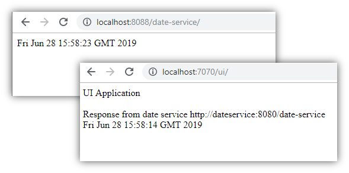

[Home](README.md)

# Docker Compose two services communication example


Refer [this](DockerizingMavenWebApplication.md) for more details on dockerizing maven applications

Clone the [project](https://github.com/enabling-cloud/docker-compose-svc-com), and execute the following commands

```Powershell
docker-compose> mvn clean package
```

```Powershell
docker-compose> docker-compose build
```


```Powershell
docker-compose> docker-compose up
```

Here is the content of `docker-compose.yml`

```Powershell
version: '2'
services:
  dateservice:
    build: ./date-service
    ports:
      - "8088:8080"
  ui:
    build: ./ui
    links:
      - "dateservice"
    ports:
      - "7070:8080"

```

context.xml file of ui app, keep a note of url environment entry.

```xml

<Context path="/ui" debug="0" reloadable="false" useHttpOnly="true"
	clearReferencesHttpClientKeepAliveThread="true"
	clearReferencesStopThreads="true" clearReferencesStopTimerThreads="true">


	<Environment name="app" type="java.lang.String"
		value="${catalina.base}/webapps/echo-service" />

	<Environment name="url" type="java.lang.String"
		value="http://dateservice:8080/date-service" />

</Context>
```

This is how the two services communicate


From localhost this is how it can be accessed.




