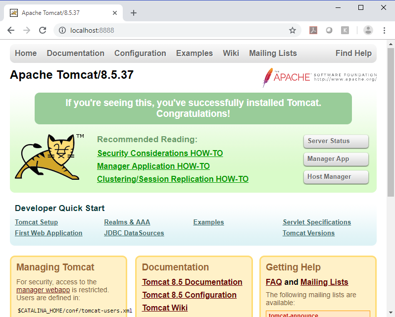

[Home](README.md)

# Docker Port Mapping And Logs

-------------------------------

```Powershell
PS C:\WINDOWS\system32> docker run -it --rm -p 8888:8080 tomcat:8.5
Unable to find image 'tomcat:8.5' locally
8.5: Pulling from library/tomcat
ab1fc7e4bf91: Pull complete
35fba333ff52: Pull complete
f0cb1fa13079: Pull complete
3d79c18d1bc0: Pull complete
ff1d0ae4641b: Pull complete
8883e662573f: Pull complete
adab760d76bd: Pull complete
86323b680e93: Pull complete
14a2c1cdce1c: Pull complete
ee59bf8c5470: Pull complete
067f988306af: Pull complete
Digest: sha256:296b26baeee450a9814b2733e9d085f3d26af1c48e5fdc2000496ff7e12bc897
Status: Downloaded newer image for tomcat:8.5
```


**Output**
```Powershell

Using CATALINA_BASE:   /usr/local/tomcat
Using CATALINA_HOME:   /usr/local/tomcat
Using CATALINA_TMPDIR: /usr/local/tomcat/temp
Using JRE_HOME:        /docker-java-home/jre
Using CLASSPATH:       /usr/local/tomcat/bin/bootstrap.jar:/usr/local/tomcat/bin/tomcat-juli.jar
05-Feb-2019 15:27:51.934 INFO [main] org.apache.catalina.startup.VersionLoggerListener.log Server version:        Apache Tomcat/8.5.37
05-Feb-2019 15:27:51.947 INFO [main] org.apache.catalina.startup.VersionLoggerListener.log Server built:          Dec 12 2018 12:07:02 UTC
05-Feb-2019 15:27:51.947 INFO [main] org.apache.catalina.startup.VersionLoggerListener.log Server number:         8.5.37.0
05-Feb-2019 15:27:51.947 INFO [main] org.apache.catalina.startup.VersionLoggerListener.log OS Name:               Linux
05-Feb-2019 15:27:51.948 INFO [main] org.apache.catalina.startup.VersionLoggerListener.log OS Version:            4.9.125-linuxkit
05-Feb-2019 15:27:51.948 INFO [main] org.apache.catalina.startup.VersionLoggerListener.log Architecture:          amd64
05-Feb-2019 15:27:51.948 INFO [main] org.apache.catalina.startup.VersionLoggerListener.log Java Home:             /usr/lib/jvm/java-8-openjdk-amd64/jre
05-Feb-2019 15:27:51.949 INFO [main] org.apache.catalina.startup.VersionLoggerListener.log JVM Version:           1.8.0_181-8u181-b13-2~deb9u1-b13
05-Feb-2019 15:27:51.950 INFO [main] org.apache.catalina.startup.VersionLoggerListener.log JVM Vendor:            Oracle Corporation
05-Feb-2019 15:27:51.951 INFO [main] org.apache.catalina.startup.VersionLoggerListener.log CATALINA_BASE:         /usr/local/tomcat
05-Feb-2019 15:27:51.951 INFO [main] org.apache.catalina.startup.VersionLoggerListener.log CATALINA_HOME:         /usr/local/tomcat
05-Feb-2019 15:27:51.955 INFO [main] org.apache.catalina.startup.VersionLoggerListener.log Command line argument: -Djava.util.logging.config.file=/usr/local/tomcat/conf/logging.properties
05-Feb-2019 15:27:51.956 INFO [main] org.apache.catalina.startup.VersionLoggerListener.log Command line argument: -Djava.util.logging.manager=org.apache.juli.ClassLoaderLogManager
05-Feb-2019 15:27:51.956 INFO [main] org.apache.catalina.startup.VersionLoggerListener.log Command line argument: -Djdk.tls.ephemeralDHKeySize=2048
05-Feb-2019 15:27:51.957 INFO [main] org.apache.catalina.startup.VersionLoggerListener.log Command line argument: -Djava.protocol.handler.pkgs=org.apache.catalina.webresources
05-Feb-2019 15:27:51.958 INFO [main] org.apache.catalina.startup.VersionLoggerListener.log Command line argument: -Dorg.apache.catalina.security.SecurityListener.UMASK=0027
05-Feb-2019 15:27:51.959 INFO [main] org.apache.catalina.startup.VersionLoggerListener.log Command line argument: -Dignore.endorsed.dirs=
05-Feb-2019 15:27:51.959 INFO [main] org.apache.catalina.startup.VersionLoggerListener.log Command line argument: -Dcatalina.base=/usr/local/tomcat
05-Feb-2019 15:27:51.960 INFO [main] org.apache.catalina.startup.VersionLoggerListener.log Command line argument: -Dcatalina.home=/usr/local/tomcat
05-Feb-2019 15:27:51.960 INFO [main] org.apache.catalina.startup.VersionLoggerListener.log Command line argument: -Djava.io.tmpdir=/usr/local/tomcat/temp
05-Feb-2019 15:27:51.960 INFO [main] org.apache.catalina.core.AprLifecycleListener.lifecycleEvent Loaded APR based Apache Tomcat Native library [1.2.19] using APR version [1.5.2].
05-Feb-2019 15:27:51.960 INFO [main] org.apache.catalina.core.AprLifecycleListener.lifecycleEvent APR capabilities: IPv6 [true], sendfile [true], accept filters [false], random [true].
05-Feb-2019 15:27:51.960 INFO [main] org.apache.catalina.core.AprLifecycleListener.lifecycleEvent APR/OpenSSL configuration: useAprConnector [false], useOpenSSL [true]
05-Feb-2019 15:27:51.981 INFO [main] org.apache.catalina.core.AprLifecycleListener.initializeSSL OpenSSL successfully initialized [OpenSSL 1.1.0j  20 Nov 2018]
05-Feb-2019 15:27:52.143 INFO [main] org.apache.coyote.AbstractProtocol.init Initializing ProtocolHandler ["http-nio-8080"]
05-Feb-2019 15:27:52.182 INFO [main] org.apache.tomcat.util.net.NioSelectorPool.getSharedSelector Using a shared selector for servlet write/read
05-Feb-2019 15:27:52.226 INFO [main] org.apache.coyote.AbstractProtocol.init Initializing ProtocolHandler ["ajp-nio-8009"]
05-Feb-2019 15:27:52.231 INFO [main] org.apache.tomcat.util.net.NioSelectorPool.getSharedSelector Using a shared selector for servlet write/read
05-Feb-2019 15:27:52.240 INFO [main] org.apache.catalina.startup.Catalina.load Initialization processed in 1199 ms
05-Feb-2019 15:27:52.276 INFO [main] org.apache.catalina.core.StandardService.startInternal Starting service [Catalina]
05-Feb-2019 15:27:52.276 INFO [main] org.apache.catalina.core.StandardEngine.startInternal Starting Servlet Engine: Apache Tomcat/8.5.37
05-Feb-2019 15:27:52.297 INFO [localhost-startStop-1] org.apache.catalina.startup.HostConfig.deployDirectory Deploying web application directory [/usr/local/tomcat/webapps/examples]
05-Feb-2019 15:27:53.372 INFO [localhost-startStop-1] org.apache.catalina.startup.HostConfig.deployDirectory Deployment of web application directory [/usr/local/tomcat/webapps/examples] has finished in [1,068] ms
05-Feb-2019 15:27:53.373 INFO [localhost-startStop-1] org.apache.catalina.startup.HostConfig.deployDirectory Deploying web application directory [/usr/local/tomcat/webapps/ROOT]
05-Feb-2019 15:27:53.410 INFO [localhost-startStop-1] org.apache.catalina.startup.HostConfig.deployDirectory Deployment of web application directory [/usr/local/tomcat/webapps/ROOT] has finished in [36] ms
05-Feb-2019 15:27:53.410 INFO [localhost-startStop-1] org.apache.catalina.startup.HostConfig.deployDirectory Deploying web application directory [/usr/local/tomcat/webapps/manager]
05-Feb-2019 15:27:53.474 INFO [localhost-startStop-1] org.apache.catalina.startup.HostConfig.deployDirectory Deployment of web application directory [/usr/local/tomcat/webapps/manager] has finished in [64] ms
05-Feb-2019 15:27:53.474 INFO [localhost-startStop-1] org.apache.catalina.startup.HostConfig.deployDirectory Deploying web application directory [/usr/local/tomcat/webapps/docs]
05-Feb-2019 15:27:53.503 INFO [localhost-startStop-1] org.apache.catalina.startup.HostConfig.deployDirectory Deployment of web application directory [/usr/local/tomcat/webapps/docs] has finished in [29] ms
05-Feb-2019 15:27:53.503 INFO [localhost-startStop-1] org.apache.catalina.startup.HostConfig.deployDirectory Deploying web application directory [/usr/local/tomcat/webapps/host-manager]
05-Feb-2019 15:27:53.542 INFO [localhost-startStop-1] org.apache.catalina.startup.HostConfig.deployDirectory Deployment of web application directory [/usr/local/tomcat/webapps/host-manager] has finished in [39] ms
05-Feb-2019 15:27:53.552 INFO [main] org.apache.coyote.AbstractProtocol.start Starting ProtocolHandler ["http-nio-8080"]
05-Feb-2019 15:27:53.580 INFO [main] org.apache.coyote.AbstractProtocol.start Starting ProtocolHandler ["ajp-nio-8009"]
05-Feb-2019 15:27:53.616 INFO [main] org.apache.catalina.startup.Catalina.start Server startup in 1375 ms
```




-------------------------------

```Powershell

PS C:\WINDOWS\system32> docker run -it -d --rm -p 8888:8080 tomcat:8.5
2a9c0a5c0e1c58cf44982ef9d25f8469867ee2088d09bf68e9c4b0442d716c94
PS C:\WINDOWS\system32>
```


```Powershell
PS C:\WINDOWS\system32> docker logs  2a9c0a5c0e1c58cf44982ef9d25f8469867ee2088d09bf68e9c4b0442d716c94

```
**Output**

```Powershell
Using CATALINA_BASE:   /usr/local/tomcat
Using CATALINA_HOME:   /usr/local/tomcat
Using CATALINA_TMPDIR: /usr/local/tomcat/temp
Using JRE_HOME:        /docker-java-home/jre
Using CLASSPATH:       /usr/local/tomcat/bin/bootstrap.jar:/usr/local/tomcat/bin/tomcat-juli.jar
05-Feb-2019 15:56:27.799 INFO [main] org.apache.catalina.startup.VersionLoggerListener.log Server version:        Apache Tomcat/8.5.37
05-Feb-2019 15:56:27.801 INFO [main] org.apache.catalina.startup.VersionLoggerListener.log Server built:          Dec 12 2018 12:07:02 UTC
05-Feb-2019 15:56:27.802 INFO [main] org.apache.catalina.startup.VersionLoggerListener.log Server number:         8.5.37.0
05-Feb-2019 15:56:27.803 INFO [main] org.apache.catalina.startup.VersionLoggerListener.log OS Name:               Linux
05-Feb-2019 15:56:27.803 INFO [main] org.apache.catalina.startup.VersionLoggerListener.log OS Version:            4.9.125-linuxkit
05-Feb-2019 15:56:27.804 INFO [main] org.apache.catalina.startup.VersionLoggerListener.log Architecture:          amd64
05-Feb-2019 15:56:27.804 INFO [main] org.apache.catalina.startup.VersionLoggerListener.log Java Home:             /usr/lib/jvm/java-8-openjdk-amd64/jre
05-Feb-2019 15:56:27.804 INFO [main] org.apache.catalina.startup.VersionLoggerListener.log JVM Version:           1.8.0_181-8u181-b13-2~deb9u1-b13
05-Feb-2019 15:56:27.805 INFO [main] org.apache.catalina.startup.VersionLoggerListener.log JVM Vendor:            Oracle Corporation
05-Feb-2019 15:56:27.805 INFO [main] org.apache.catalina.startup.VersionLoggerListener.log CATALINA_BASE:         /usr/local/tomcat
05-Feb-2019 15:56:27.806 INFO [main] org.apache.catalina.startup.VersionLoggerListener.log CATALINA_HOME:         /usr/local/tomcat
05-Feb-2019 15:56:27.806 INFO [main] org.apache.catalina.startup.VersionLoggerListener.log Command line argument: -Djava.util.logging.config.file=/usr/local/tomcat/conf/logging.properties
05-Feb-2019 15:56:27.807 INFO [main] org.apache.catalina.startup.VersionLoggerListener.log Command line argument: -Djava.util.logging.manager=org.apache.juli.ClassLoaderLogManager
05-Feb-2019 15:56:27.808 INFO [main] org.apache.catalina.startup.VersionLoggerListener.log Command line argument: -Djdk.tls.ephemeralDHKeySize=2048
05-Feb-2019 15:56:27.808 INFO [main] org.apache.catalina.startup.VersionLoggerListener.log Command line argument: -Djava.protocol.handler.pkgs=org.apache.catalina.webresources
05-Feb-2019 15:56:27.808 INFO [main] org.apache.catalina.startup.VersionLoggerListener.log Command line argument: -Dorg.apache.catalina.security.SecurityListener.UMASK=0027
05-Feb-2019 15:56:27.809 INFO [main] org.apache.catalina.startup.VersionLoggerListener.log Command line argument: -Dignore.endorsed.dirs=
05-Feb-2019 15:56:27.809 INFO [main] org.apache.catalina.startup.VersionLoggerListener.log Command line argument: -Dcatalina.base=/usr/local/tomcat
05-Feb-2019 15:56:27.809 INFO [main] org.apache.catalina.startup.VersionLoggerListener.log Command line argument: -Dcatalina.home=/usr/local/tomcat
05-Feb-2019 15:56:27.810 INFO [main] org.apache.catalina.startup.VersionLoggerListener.log Command line argument: -Djava.io.tmpdir=/usr/local/tomcat/temp
05-Feb-2019 15:56:27.811 INFO [main] org.apache.catalina.core.AprLifecycleListener.lifecycleEvent Loaded APR based Apache Tomcat Native library [1.2.19] using APR version [1.5.2].
05-Feb-2019 15:56:27.811 INFO [main] org.apache.catalina.core.AprLifecycleListener.lifecycleEvent APR capabilities: IPv6 [true], sendfile [true], accept filters [false], random [true].
05-Feb-2019 15:56:27.811 INFO [main] org.apache.catalina.core.AprLifecycleListener.lifecycleEvent APR/OpenSSL configuration: useAprConnector [false], useOpenSSL [true]
05-Feb-2019 15:56:27.818 INFO [main] org.apache.catalina.core.AprLifecycleListener.initializeSSL OpenSSL successfully initialized [OpenSSL 1.1.0j  20 Nov 2018]
05-Feb-2019 15:56:27.945 INFO [main] org.apache.coyote.AbstractProtocol.init Initializing ProtocolHandler ["http-nio-8080"]
05-Feb-2019 15:56:27.960 INFO [main] org.apache.tomcat.util.net.NioSelectorPool.getSharedSelector Using a shared selector for servlet write/read
05-Feb-2019 15:56:27.986 INFO [main] org.apache.coyote.AbstractProtocol.init Initializing ProtocolHandler ["ajp-nio-8009"]
05-Feb-2019 15:56:27.995 INFO [main] org.apache.tomcat.util.net.NioSelectorPool.getSharedSelector Using a shared selector for servlet write/read
05-Feb-2019 15:56:28.009 INFO [main] org.apache.catalina.startup.Catalina.load Initialization processed in 800 ms
05-Feb-2019 15:56:28.049 INFO [main] org.apache.catalina.core.StandardService.startInternal Starting service [Catalina]
05-Feb-2019 15:56:28.050 INFO [main] org.apache.catalina.core.StandardEngine.startInternal Starting Servlet Engine: Apache Tomcat/8.5.37
05-Feb-2019 15:56:28.080 INFO [localhost-startStop-1] org.apache.catalina.startup.HostConfig.deployDirectory Deploying web application directory [/usr/local/tomcat/webapps/examples]
05-Feb-2019 15:56:29.028 INFO [localhost-startStop-1] org.apache.catalina.startup.HostConfig.deployDirectory Deployment of web application directory [/usr/local/tomcat/webapps/examples] has finished in [947] ms
05-Feb-2019 15:56:29.031 INFO [localhost-startStop-1] org.apache.catalina.startup.HostConfig.deployDirectory Deploying web application directory [/usr/local/tomcat/webapps/ROOT]
05-Feb-2019 15:56:29.107 INFO [localhost-startStop-1] org.apache.catalina.startup.HostConfig.deployDirectory Deployment of web application directory [/usr/local/tomcat/webapps/ROOT] has finished in [75] ms
05-Feb-2019 15:56:29.108 INFO [localhost-startStop-1] org.apache.catalina.startup.HostConfig.deployDirectory Deploying web application directory [/usr/local/tomcat/webapps/manager]
05-Feb-2019 15:56:29.174 INFO [localhost-startStop-1] org.apache.catalina.startup.HostConfig.deployDirectory Deployment of web application directory [/usr/local/tomcat/webapps/manager] has finished in [67] ms
05-Feb-2019 15:56:29.175 INFO [localhost-startStop-1] org.apache.catalina.startup.HostConfig.deployDirectory Deploying web application directory [/usr/local/tomcat/webapps/docs]
05-Feb-2019 15:56:29.200 INFO [localhost-startStop-1] org.apache.catalina.startup.HostConfig.deployDirectory Deployment of web application directory [/usr/local/tomcat/webapps/docs] has finished in [25] ms
05-Feb-2019 15:56:29.201 INFO [localhost-startStop-1] org.apache.catalina.startup.HostConfig.deployDirectory Deploying web application directory [/usr/local/tomcat/webapps/host-manager]
05-Feb-2019 15:56:29.236 INFO [localhost-startStop-1] org.apache.catalina.startup.HostConfig.deployDirectory Deployment of web application directory [/usr/local/tomcat/webapps/host-manager] has finished in [35] ms
05-Feb-2019 15:56:29.243 INFO [main] org.apache.coyote.AbstractProtocol.start Starting ProtocolHandler ["http-nio-8080"]
05-Feb-2019 15:56:29.259 INFO [main] org.apache.coyote.AbstractProtocol.start Starting ProtocolHandler ["ajp-nio-8009"]
05-Feb-2019 15:56:29.266 INFO [main] org.apache.catalina.startup.Catalina.start Server startup in 1256 ms
PS C:\WINDOWS\system32>

```
Refer the [command line reference](https://docs.docker.com/engine/reference/commandline/logs/) for more detail.

-------------------------------

