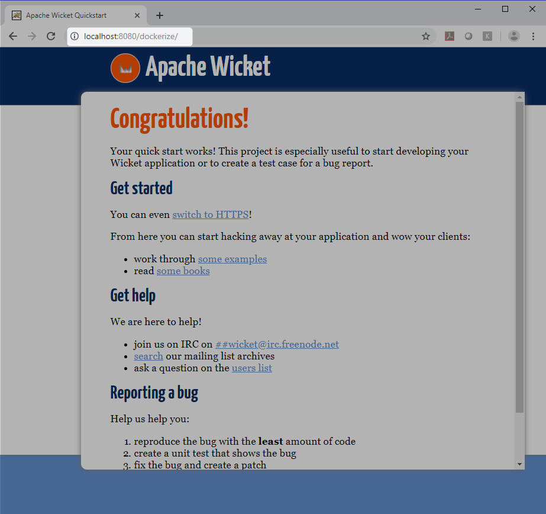

# Dockerizing Maven Web Application

 There are couple of Docker Maven plugins available for free on GitHub.
 
* [fabric8io/docker-maven-plugin](https://github.com/fabric8io/docker-maven-plugin)
* [spotify/docker-maven-plugin](https://github.com/spotify/docker-maven-plugin)
* [wouterd/docker-maven-plugin](https://github.com/wouterd/docker-maven-plugin)
* [alexec/docker-maven-plugin](https://github.com/alexec/docker-maven-plugin)

## Building

Add the following in your maven pom file

```Powershell
<plugin>
    <groupId>io.fabric8</groupId>
    <artifactId>docker-maven-plugin</artifactId>
    <version>0.27.2</version>
    <executions>
        <execution>
            <id>start</id>
            <phase>pre-integration-test</phase>
            <goals>
                <goal>build</goal>
                <goal>start</goal>
            </goals>
        </execution>
        <execution>
            <id>stop</id>
            <phase>post-integration-test</phase>
            <goals>
                <goal>stop</goal>
            </goals>
        </execution>
    </executions>

    <configuration>
        <images>
            <image> 
                <name>docker.io/mnadeem/dockerize-maven-web-app</name> 

                <build>
                    <dockerFile>${project.basedir}/Dockerfile</dockerFile >
                </build> 
                <run>
                    <!-- Assign dynamically mapped ports to maven variables (which can be reused in integration tests) -->
                    <ports>
                        <port>8080:8080</port>
                    </ports>
                    <wait>
                        <!-- Check for this URL to return a 200 return code .... -->
                        <url>http://localhost:8080/dockerize</url>
                        <!-- ... but at max 2 minutes -->
                        <time>120000</time>
                    </wait>								
                    
                </run>
            </image>

        </images>
    </configuration>
</plugin>
```
Add the following under project root.

```Powershell
FROM tomcat:9.0-jre8-alpine
COPY target/dockerize-maven-web-app*.war $CATALINA_HOME/webapps/dockerize.war
HEALTHCHECK --interval=1m --timeout=3s CMD wget --quiet --tries=1 --spider http://localhost:8080/dockerize || exit 1
EXPOSE 8080
CMD chmod +x $CATALINA_HOME/bin/catalina.sh
CMD ["catalina.sh", "run"]

```

## Execution

Execute `mvn docker:build`

```Powershell
D:\practices\docker\maven-docker>mvn docker:build
[INFO] Scanning for projects...
[INFO]
[INFO] ------------------------------------------------------------------------
[INFO] Building quickstart 1.0-SNAPSHOT
[INFO] ------------------------------------------------------------------------
[INFO]
[INFO] --- docker-maven-plugin:0.27.2:build (default-cli) @ dockerize-maven-web-app ---
[INFO] Building tar: D:\practices\docker\maven-docker\target\docker\docker.io\mnadeem\dockerize-maven-web-app\tmp\docker-build.tar
[INFO] DOCKER> [docker.io/mnadeem/dockerize-maven-web-app:latest]: Created docker-build.tar in 564 milliseconds
[INFO] DOCKER> [docker.io/mnadeem/dockerize-maven-web-app:latest]: Built image sha256:93f0b
[INFO] ------------------------------------------------------------------------
[INFO] BUILD SUCCESS
[INFO] ------------------------------------------------------------------------
[INFO] Total time: 3.492 s
[INFO] Finished at: 2019-03-30T23:59:22+05:30
[INFO] Final Memory: 13M/237M
[INFO] ------------------------------------------------------------------------

D:\practices\docker\maven-docker>
```


```Powershell
D:\practices\docker\maven-docker>docker ps
CONTAINER ID        IMAGE               COMMAND             CREATED             STATUS              PORTS               NAMES

```


```Powershell
D:\practices\docker\maven-docker>mvn docker:start
[INFO] Scanning for projects...
[INFO]
[INFO] ------------------------------------------------------------------------
[INFO] Building quickstart 1.0-SNAPSHOT
[INFO] ------------------------------------------------------------------------
[INFO]
[INFO] --- docker-maven-plugin:0.27.2:start (default-cli) @ dockerize-maven-web-app ---
[INFO] DOCKER> [docker.io/mnadeem/dockerize-maven-web-app:latest]: Start container d65674a68383
[INFO] DOCKER> [docker.io/mnadeem/dockerize-maven-web-app:latest]: Waiting on url http://localhost:8080/dockerize.
[INFO] DOCKER> [docker.io/mnadeem/dockerize-maven-web-app:latest]: Waited on url http://localhost:8080/dockerize 3948 ms
[INFO] ------------------------------------------------------------------------
[INFO] BUILD SUCCESS
[INFO] ------------------------------------------------------------------------
[INFO] Total time: 8.205 s
[INFO] Finished at: 2019-03-31T00:01:17+05:30
[INFO] Final Memory: 15M/229M
[INFO] ------------------------------------------------------------------------
```

```Powershell
D:\practices\docker\maven-docker>docker ps
CONTAINER ID        IMAGE                             COMMAND             CREATED             STATUS                             PORTS                    NAMES
d65674a68383        mnadeem/dockerize-maven-web-app   "catalina.sh run"   12 seconds ago      Up 10 seconds (health: starting)   0.0.0.0:8080->8080/tcp   dockerize-maven-web-app-1

D:\practices\docker\maven-docker>
```




```Powershell
D:\practices\docker\maven-docker>mvn docker:stop
[INFO] Scanning for projects...
[INFO]
[INFO] ------------------------------------------------------------------------
[INFO] Building quickstart 1.0-SNAPSHOT
[INFO] ------------------------------------------------------------------------
[INFO]
[INFO] --- docker-maven-plugin:0.27.2:stop (default-cli) @ dockerize-maven-web-app ---
[INFO] DOCKER> [docker.io/mnadeem/dockerize-maven-web-app:latest]: Stop and removed container d65674a68383 after 0 ms
[INFO] ------------------------------------------------------------------------
[INFO] BUILD SUCCESS
[INFO] ------------------------------------------------------------------------
[INFO] Total time: 5.598 s
[INFO] Finished at: 2019-03-31T00:05:42+05:30
[INFO] Final Memory: 12M/216M
[INFO] ------------------------------------------------------------------------
```

```Powershell
D:\practices\docker\maven-docker>docker ps
CONTAINER ID        IMAGE               COMMAND             CREATED             STATUS              PORTS               NAMES

D:\practices\docker\maven-docker>
```


# References


* [fabric8 home](https://dmp.fabric8.io/)