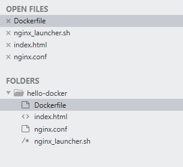
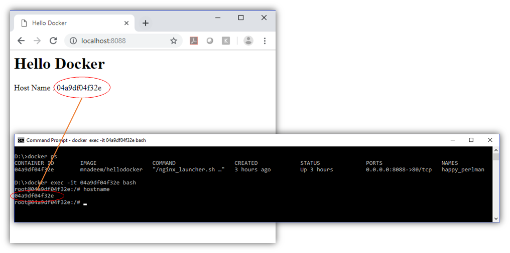

[Home](README.md)

# Lets Build Hello Docker Nginx Image

This doker would expose http port 80 and display hello and hostname.





**index.html**
```Powershell
<html>
<head>
    <title>Hello Docker</title>
</head>
<body>
 
  <div>
      <h1>Hello Docker</h1>     
      <div>Host Name : HOST_NAME </div>
  </div>
 
</body>
</html>
```

**nginx_launcher.sh**

```Powershell
#!/bin/sh
 
# Replace the HOST_NAME in the index.html for container
sed -i.bak 's/HOST_NAME/'"$HOSTNAME"'/g' /www/data/index.html
 
# Startup the cmd
exec "$@"
```


**nginx.conf**

```Powershell
orker_processes 1;
 
events {
  worker_connections 1024; # increase if you have lots of clients 
}
 
http {
 
  access_log /var/log/nginx/access.log combined;
  sendfile on;
 
  server {
    # use 'listen 80 deferred;' for Linux
    # use 'listen 80 accept_filter=httpready;' for FreeBSD
    listen 80;
 
    keepalive_timeout 5;
 
    # path for static files
    root /www/data;
 
    location / {
      
    }
  }
}
```

**Dockerfile**

```Powershell
FROM nginx
 
RUN apt-get update && apt-get install -y \
 vim wget dialog net-tools
 
# Remove the default Nginx configuration file
RUN rm -v /etc/nginx/nginx.conf
 
# Copy a configuration file from the current directory
ADD nginx.conf /etc/nginx/
 
RUN mkdir /etc/nginx/logs
 
# Add a sample index file
ADD index.html /www/data/
 
# Append "daemon off;" to the beginning of the configuration
RUN echo "daemon off;" >> /etc/nginx/nginx.conf
 
# Create a runner script for the entrypoint
COPY nginx_launcher.sh /nginx_launcher.sh
RUN chmod +x /nginx_launcher.sh
 
# Expose ports
EXPOSE 80
 
ENTRYPOINT ["/nginx_launcher.sh"]
 
# Set the default command to execute
# when creating a new container
CMD ["nginx"]
```

[Download](https://sourceforge.net/projects/dos2unix/) dos2unix 

Run **dos2unix** on _nginx_launcher.sh_

```Powershell
D:\practices\docker\hello-docker>D:\softwares\dos2unix\bin\dos2unix.exe nginx_launcher.sh
dos2unix: converting file nginx_launcher.sh to Unix format...
```

Run `docker build`

```Powershell
D:\practices\docker\hello-docker>docker build -t mnadeem/hellodocker .
Sending build context to Docker daemon  5.632kB
Step 1/12 : FROM nginx
 ---> 2bcb04bdb83f
Step 2/12 : RUN apt-get update && apt-get install -y  vim wget dialog net-tools
 ---> Using cache
 ---> 445d987fb3db
Step 3/12 : RUN rm -v /etc/nginx/nginx.conf
 ---> Using cache
 ---> e3592775d924
Step 4/12 : ADD nginx.conf /etc/nginx/
 ---> Using cache
 ---> 6ca6ee119cb4
Step 5/12 : RUN mkdir /etc/nginx/logs
 ---> Using cache
 ---> 75e29d0bf7f6
Step 6/12 : ADD index.html /www/data/
 ---> Using cache
 ---> 0acd812a005c
Step 7/12 : RUN echo "daemon off;" >> /etc/nginx/nginx.conf
 ---> Using cache
 ---> b5f09f4bd8b4
Step 8/12 : COPY nginx_launcher.sh /nginx_launcher.sh
 ---> 70494fab78ac
Step 9/12 : RUN chmod +x /nginx_launcher.sh
 ---> Running in d38f836f359f
Removing intermediate container d38f836f359f
 ---> 5fada8c56338
Step 10/12 : EXPOSE 80
 ---> Running in ea6b9e88195d
Removing intermediate container ea6b9e88195d
 ---> ba00f3f0481b
Step 11/12 : ENTRYPOINT ["/nginx_launcher.sh"]
 ---> Running in 9305361fa430
Removing intermediate container 9305361fa430
 ---> 4a80c1ce367f
Step 12/12 : CMD ["nginx"]
 ---> Running in 5cb6d42290f0
Removing intermediate container 5cb6d42290f0
 ---> e9a81a24c07d
Successfully built e9a81a24c07d
Successfully tagged mnadeem/hellodocker:latest
SECURITY WARNING: You are building a Docker image from Windows against a non-Windows Docker host. All files and directories added to build context will have '-rwxr-xr-x' permissions. It is recommended to double check and reset permissions for sensitive files and directories.
```

Run `docker run`

```Powershell

D:\practices\docker\hello-docker>docker run -p 8088:80 mnadeem/hellodocker
```


