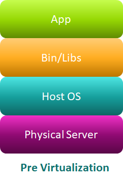
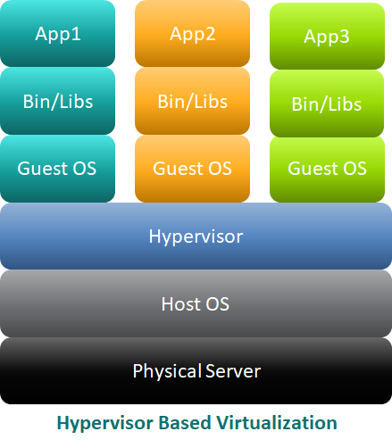
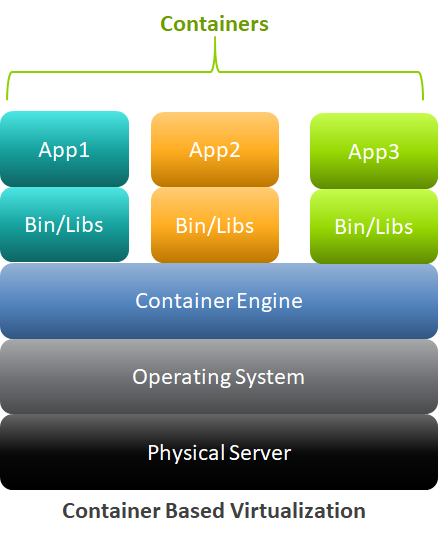
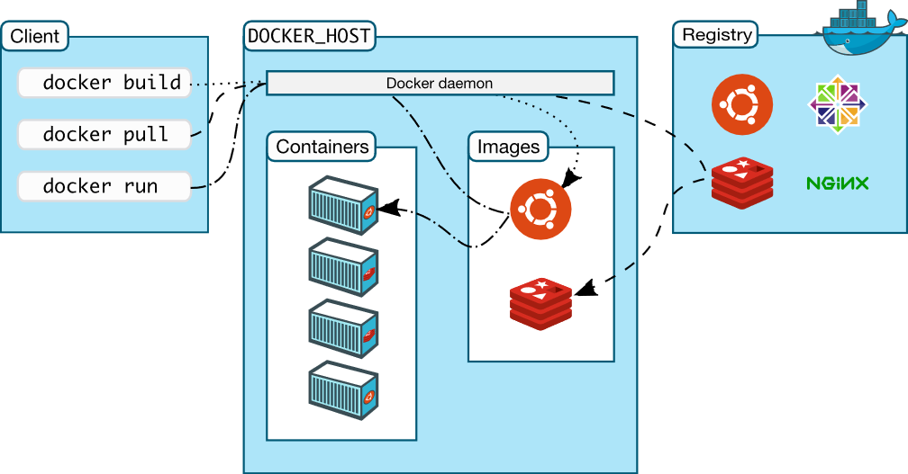

# Container Based Virtualization Using Docker

### Docker's Client Server Architecture

# Pages

|    **Name**   | **Duration** |
| ------------- |-----:|
|[**Installation**](installation.md)|5 minutes|
|[**Run Docker Container**](RunDockerContainer.md)|30 minutes|
|[**Docker Port Mapping And Logs**](DockerPortMappingAndLogs.md)|30 minutes|
|[**Build Docker Images**](BuildDockerImages.md)|30 minutes|
|[**Containerize Tomcat Application**](ContainerizeTomcatApplication.md)|30 minutes|
|[**Running Oracle Docker Image**](RunningOracleDockerImage.md)|30 minutes|
|[**Dockerizing Maven Web Application**](DockerizingMavenWebApplication.md)|30 minutes|
|[**Connect To Docker VM On Windows**](ConnectIntoDockerVMOnWindows.md)|30 minutes|

# References

* [Docker Architecture](https://www.aquasec.com/wiki/display/containers/Docker+Architecture)
* [Docker Overview](https://docs.docker.com/engine/docker-overview/)
* [Docker IntelliJ Idea](https://www.jetbrains.com/help/idea/docker.html)

