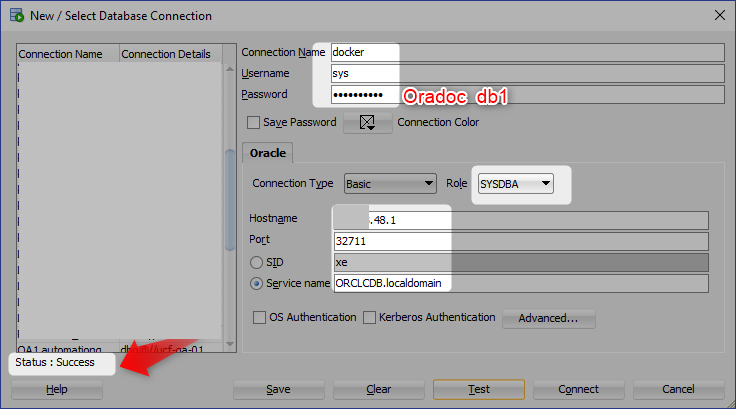

[Home](README.md)

# Running Oracle 12.2 Docker Image

## Accept The License 
Goto  container-registry.oracle.com

Login and accept the terms and condition


And then login in a command prompt, Use OTN Credential, same as above

```Powershell
PS D:\practices\docker\web-app> docker login container-registry.oracle.com
Authenticating with existing credentials...
Login Succeeded
PS D:\practices\docker\web-app>
```

```Powershell
docker pull container-registry.oracle.com/database/enterprise:12.2.0.1
```

**Output**
```Powershell
PS C:\WINDOWS\system32> docker pull container-registry.oracle.com/database/enterprise:12.2.0.1
12.2.0.1: Pulling from database/enterprise
f07cd347d7cc: Pull complete
e6d45c5d2f56: Pull complete
0c3e3e3a81c6: Pull complete
522e6a16038b: Pull complete
b49278619f9a: Pull complete
Digest: sha256:1f700299f7a96c5ffcdb14e251745f1cf3832fc32fff59ee7fdce956bd5b5bf8
Status: Downloaded newer image for container-registry.oracle.com/database/enterprise:12.2.0.1
PS C:\WINDOWS\system32>
```


```Powershell
PS C:\WINDOWS\system32> docker images
REPOSITORY                                          TAG                 IMAGE ID            CREATED             SIZE
container-registry.oracle.com/database/enterprise   12.2.0.1            12a359cd0528        18 months ago       3.44GB
PS C:\WINDOWS\system32>
```


```Powershell
PS C:\WINDOWS\system32> docker run -d -it --name OracleDB -p 32711:1521 container-registry.oracle.com/database/enterprise:12.2.0.1
f72d508e6243d31b4630e3264afbdd9ee10a0f3ef78e099f9a53bacb30f8da30
PS C:\WINDOWS\system32>
```


```Powershell
PS C:\WINDOWS\system32> docker ps
CONTAINER ID        IMAGE                                                        COMMAND                  CREATED             STATUS                            PORTS                               NAMES
f72d508e6243        container-registry.oracle.com/database/enterprise:12.2.0.1   "/bin/sh -c '/bin/ba…"   9 seconds ago       Up 7 seconds (health: starting)   5500/tcp, 0.0.0.0:32711->1521/tcp   OracleDB

```


```Powershell
PS C:\WINDOWS\system32> docker port OracleDB
1521/tcp -> 0.0.0.0:32711
PS C:\WINDOWS\system32>
```


```Powershell
PS C:\WINDOWS\system32> docker ps
CONTAINER ID        IMAGE                                                        COMMAND                  CREATED             STATUS                    PORTS                               NAMES
f72d508e6243        container-registry.oracle.com/database/enterprise:12.2.0.1   "/bin/sh -c '/bin/ba…"   41 minutes ago      Up 41 minutes (healthy)   5500/tcp, 0.0.0.0:32711->1521/tcp   OracleDB

```

```Powershell
PS C:\WINDOWS\system32> docker logs f72d508e6243
```
**Output**
```Powershell
PS C:\WINDOWS\system32> docker logs f72d508e6243
Setup Oracle Database
Oracle Database 12.2.0.1 Setup
Mon Feb 11 06:56:41 UTC 2019
 
Check parameters ......
log file is : /home/oracle/setup/log/paramChk.log
paramChk.sh is done at 0 sec
 
untar DB bits ......
log file is : /home/oracle/setup/log/untarDB.log
untarDB.sh is done at 87 sec
 
config DB ......
log file is : /home/oracle/setup/log/configDB.log
Mon Feb 11 06:58:08 UTC 2019
Start Docker DB configuration
Call configDBora.sh to configure database
Mon Feb 11 06:58:08 UTC 2019
Configure DB as oracle user
Setup Database directories ...
 
SQL*Plus: Release 12.2.0.1.0 Production on Mon Feb 11 06:58:08 2019
 
Copyright (c) 1982, 2016, Oracle.  All rights reserved.
 
Connected to an idle instance.
 
SQL>
File created.
 
SQL> ORACLE instance started.
 
Total System Global Area 1342177280 bytes
Fixed Size                  8792536 bytes
Variable Size             352323112 bytes
Database Buffers          973078528 bytes
Redo Buffers                7983104 bytes
Database mounted.
Database opened.
SQL>
Database altered.
 
SQL>
NAME                                 TYPE        VALUE
------------------------------------ ----------- ------------------------------
spfile                               string      /u01/app/oracle/product/12.2.0
                                                 /dbhome_1/dbs/spfileORCLCDB.or
                                                 a
SQL>
NAME                                 TYPE        VALUE
------------------------------------ ----------- ------------------------------
encrypt_new_tablespaces              string      CLOUD_ONLY
SQL>
User altered.
 
SQL>
User altered.
 
SQL> Disconnected from Oracle Database 12c Enterprise Edition Release 12.2.0.1.0 - 64bit Production
update password
 
Enter password for SYS:
create pdb : ORCLPDB1
 
SQL*Plus: Release 12.2.0.1.0 Production on Mon Feb 11 06:58:28 2019
 
Copyright (c) 1982, 2016, Oracle.  All rights reserved.
 
 
Connected to:
Oracle Database 12c Enterprise Edition Release 12.2.0.1.0 - 64bit Production
 
SQL>   2    3    4    5
Pluggable database created.
 
SQL>
Pluggable database altered.
 
SQL>
Pluggable database altered.
 
SQL> Disconnected from Oracle Database 12c Enterprise Edition Release 12.2.0.1.0 - 64bit Production
Reset Database parameters
 
SQL*Plus: Release 12.2.0.1.0 Production on Mon Feb 11 06:58:44 2019
 
Copyright (c) 1982, 2016, Oracle.  All rights reserved.
 
 
Connected to:
Oracle Database 12c Enterprise Edition Release 12.2.0.1.0 - 64bit Production
 
SQL>
System altered.
 
SQL> Disconnected from Oracle Database 12c Enterprise Edition Release 12.2.0.1.0 - 64bit Production
 
LSNRCTL for Linux: Version 12.2.0.1.0 - Production on 11-FEB-2019 06:58:44
 
Copyright (c) 1991, 2016, Oracle.  All rights reserved.
 
Starting /u01/app/oracle/product/12.2.0/dbhome_1/bin/tnslsnr: please wait...
 
TNSLSNR for Linux: Version 12.2.0.1.0 - Production
System parameter file is /u01/app/oracle/product/12.2.0/dbhome_1/admin/ORCLCDB/listener.ora
Log messages written to /u01/app/oracle/diag/tnslsnr/f72d508e6243/listener/alert/log.xml
Listening on: (DESCRIPTION=(ADDRESS=(PROTOCOL=tcp)(HOST=0.0.0.0)(PORT=1521)))
Listening on: (DESCRIPTION=(ADDRESS=(PROTOCOL=ipc)(KEY=EXTPROC1521)))
 
Connecting to (DESCRIPTION=(ADDRESS=(PROTOCOL=TCP)(HOST=0.0.0.0)(PORT=1521)))
STATUS of the LISTENER
------------------------
Alias                     LISTENER
Version                   TNSLSNR for Linux: Version 12.2.0.1.0 - Production
Start Date                11-FEB-2019 06:58:45
Uptime                    0 days 0 hr. 0 min. 1 sec
Trace Level               off
Security                  ON: Local OS Authentication
SNMP                      OFF
Listener Parameter File   /u01/app/oracle/product/12.2.0/dbhome_1/admin/ORCLCDB/listener.ora
Listener Log File         /u01/app/oracle/diag/tnslsnr/f72d508e6243/listener/alert/log.xml
Listening Endpoints Summary...
  (DESCRIPTION=(ADDRESS=(PROTOCOL=tcp)(HOST=0.0.0.0)(PORT=1521)))
  (DESCRIPTION=(ADDRESS=(PROTOCOL=ipc)(KEY=EXTPROC1521)))
The listener supports no services
The command completed successfully
 
DONE!
Remove password info
Docker DB configuration is complete !
configDB.sh is done at 124 sec
 
Done ! The database is ready for use .
# ===========================================================================
# == Add below entries to your tnsnames.ora to access this database server ==
# ====================== from external host =================================
ORCLCDB=(DESCRIPTION=(ADDRESS=(PROTOCOL=TCP)(HOST=<ip-address>)(PORT=<port>))
    (CONNECT_DATA=(SERVER=DEDICATED)(SERVICE_NAME=ORCLCDB.localdomain)))
ORCLPDB1=(DESCRIPTION=(ADDRESS=(PROTOCOL=TCP)(HOST=<ip-address>)(PORT=<port>))
    (CONNECT_DATA=(SERVER=DEDICATED)(SERVICE_NAME=ORCLPDB1.localdomain)))
#
#ip-address : IP address of the host where the container is running.
#port       : Host Port that is mapped to the port 1521 of the container.
#
# The mapped port can be obtained from running "docker port <container-id>"
# ===========================================================================
Thread 1 advanced to log sequence 5 (LGWR switch)
  Current log# 2 seq# 5 mem# 0: /u04/app/oracle/redo/redo002.log
2019-02-11T06:58:43.974271+00:00
ORCLPDB1(3):Opening pdb with no Resource Manager plan active
Pluggable database ORCLPDB1 opened read write
Completed:     alter pluggable database ORCLPDB1 open
    alter pluggable database all save state
Completed:     alter pluggable database all save state
2019-02-11T06:58:44.271009+00:00
ALTER SYSTEM SET encrypt_new_tablespaces='DDL' SCOPE=BOTH;
2019-02-11T06:59:23.126033+00:00
TABLE SYS.WRP$_REPORTS: ADDED INTERVAL PARTITION SYS_P287 (3329) VALUES LESS THAN (TO_DATE(' 2019-02-12 01:00:00', 'SYYYY-MM-DD HH24:MI:SS', 'NLS_CALENDAR=GREGORIAN'))
TABLE SYS.WRP$_REPORTS_DETAILS: ADDED INTERVAL PARTITION SYS_P288 (3329) VALUES LESS THAN (TO_DATE(' 2019-02-12 01:00:00', 'SYYYY-MM-DD HH24:MI:SS', 'NLS_CALENDAR=GREGORIAN'))
TABLE SYS.WRP$_REPORTS_TIME_BANDS: ADDED INTERVAL PARTITION SYS_P291 (3328) VALUES LESS THAN (TO_DATE(' 2019-02-11 01:00:00', 'SYYYY-MM-DD HH24:MI:SS', 'NLS_CALENDAR=GREGORIAN'))
2019-02-11T07:08:20.789896+00:00
Resize operation completed for file# 3, old size 706560K, new size 727040K
2019-02-11T07:08:20.793446+00:00
ORCLPDB1(3):Resize operation completed for file# 18, old size 583680K, new size 604160K
2019-02-11T07:08:30.483739+00:00
Thread 1 advanced to log sequence 6 (LGWR switch)
  Current log# 3 seq# 6 mem# 0: /u04/app/oracle/redo/redo003.log
2019-02-11T07:08:30.943491+00:00
Thread 1 advanced to log sequence 7 (LGWR switch)
  Current log# 1 seq# 7 mem# 0: /u04/app/oracle/redo/redo001.log
2019-02-11T07:08:32.484643+00:00
Thread 1 cannot allocate new log, sequence 8
Checkpoint not complete
  Current log# 1 seq# 7 mem# 0: /u04/app/oracle/redo/redo001.log
2019-02-11T07:08:34.510360+00:00
Thread 1 advanced to log sequence 8 (LGWR switch)
  Current log# 2 seq# 8 mem# 0: /u04/app/oracle/redo/redo002.log
2019-02-11T07:08:34.541244+00:00
Shared IO Pool defaulting to 64MB. Trying to get it from Buffer Cache for process 729.
2019-02-11T07:08:34.801134+00:00
Thread 1 cannot allocate new log, sequence 9
Checkpoint not complete
  Current log# 2 seq# 8 mem# 0: /u04/app/oracle/redo/redo002.log
2019-02-11T07:08:37.611282+00:00
Thread 1 advanced to log sequence 9 (LGWR switch)
  Current log# 3 seq# 9 mem# 0: /u04/app/oracle/redo/redo003.log
2019-02-11T07:28:22.620703+00:00
Thread 1 advanced to log sequence 10 (LGWR switch)
  Current log# 1 seq# 10 mem
```


The default password for sys is Oradoc_db1, login with your IPv4 Address



