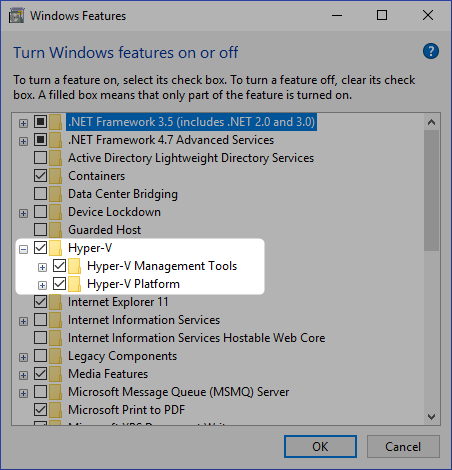
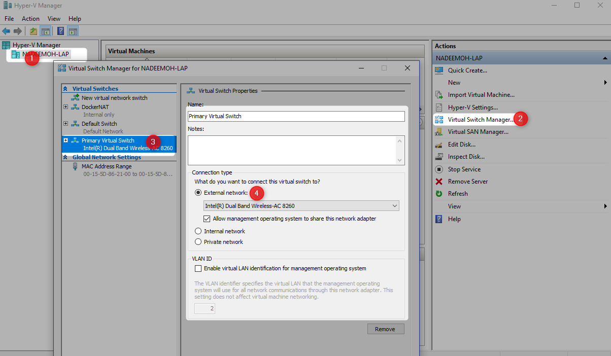

[Home](README.md)

# Docker Installation

## Windows

Refer [**this**](https://docs.docker.com/docker-for-windows/install/) for more details

After the installation, make sure the following 

### Enable Hyper-V

### Create new External Virtual Switch

## MAC
Refer [**this**](https://docs.docker.com/docker-for-mac/install/) for more detail

## Linux
Refer [**this**](https://docs.docker.com/install/linux/docker-ce/binaries/) for linux binaries and installation steps.